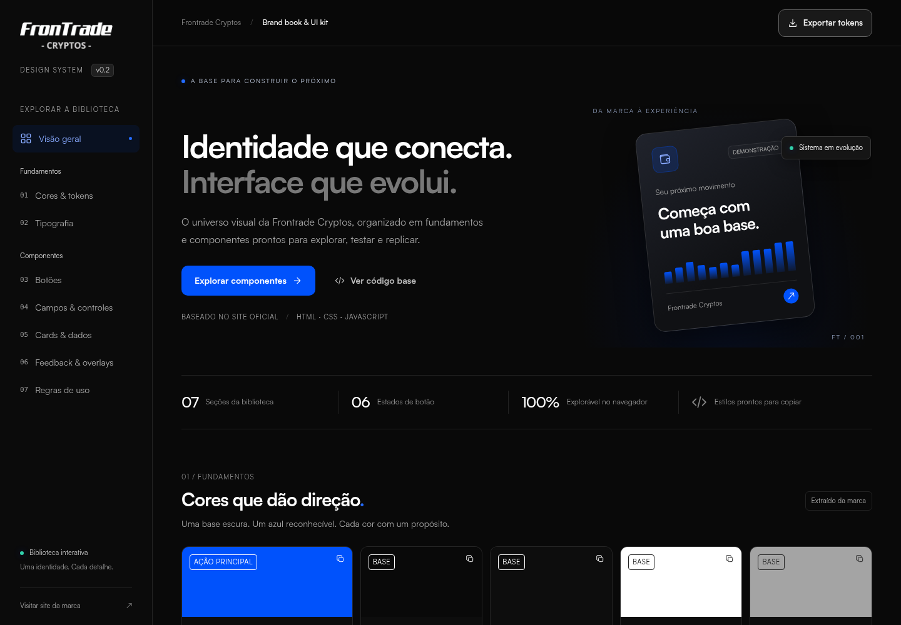
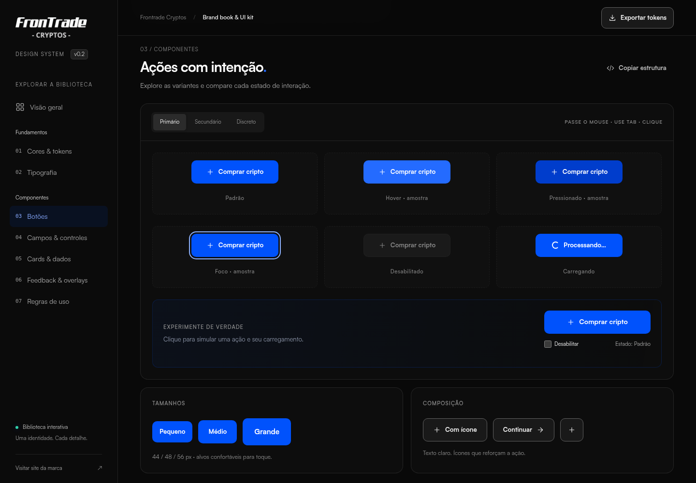

# Frontrade Cryptos — Brand book & UI kit

Biblioteca interativa da identidade Frontrade Cryptos, com fundamentos visuais, componentes e estados para reutilizar no sistema. **Versão 0.2.**



## Abrir a biblioteca

Abra `frontrade-brand-book.html` no navegador para usar a versão com todos os recursos incorporados, ou `index.html` para trabalhar com os arquivos separados. A biblioteca funciona localmente, sem instalar dependências e sem chamadas externas.

Para servir localmente, execute na pasta do projeto:

```sh
python -m http.server 3000
```

Depois, acesse http://localhost:3000.

## Componentes

- Cores, tokens, tipografia, espaçamento e cantos.
- Botões primário, secundário e discreto: padrão, hover, pressionado, foco, desabilitado e carregamento.
- Campos, validação, checkbox, radio e switch.
- Cards, tabelas, busca, ordenação e estados vazios.
- Alertas, toast, acordeão e modal de confirmação.
- Cópia de estruturas e exportação dos tokens CSS.



## Arquivos

- `index.html`: página e estruturas dos componentes.
- `styles.css`: identidade, variantes, estados e layout responsivo.
- `app.js`: demonstrações, busca, ordenação, modal, cópia e exportação.
- `assets/`: logotipo e fontes Satoshi usados pelo site de referência.
- `brand-book-base.md`: levantamento inicial e propostas para o sistema.
- `HANDOFF.md`: regras de implementação para estados, foco e carregamento.
- `REVISAO.md`: ajustes e verificações da versão 0.2.
- `build.py`: gera novamente o HTML único e o ZIP após alterações.

Os exemplos usam dados fictícios e não executam operações reais. Os estilos extraídos da marca e as extensões propostas estão indicados na página.

Para replicar componentes, inclua `styles.css` e preserve a pasta `assets`. O JavaScript da biblioteca demonstra os fluxos; adapte os handlers às ações do seu sistema. O botão **Exportar tokens** baixa as variáveis CSS para reutilização.

## Gerar a versão para compartilhar

Depois de editar os arquivos separados, execute:

```sh
python build.py
```

O script atualiza `frontrade-brand-book.html` e cria `frontrade-ui-kit.zip` na pasta acima do projeto. Os arquivos internos do Git e as prévias em PNG ficam fora do ZIP.

Referência visual: https://frontradecryptos.com/ · versão 0.2, outubro de 2026.
